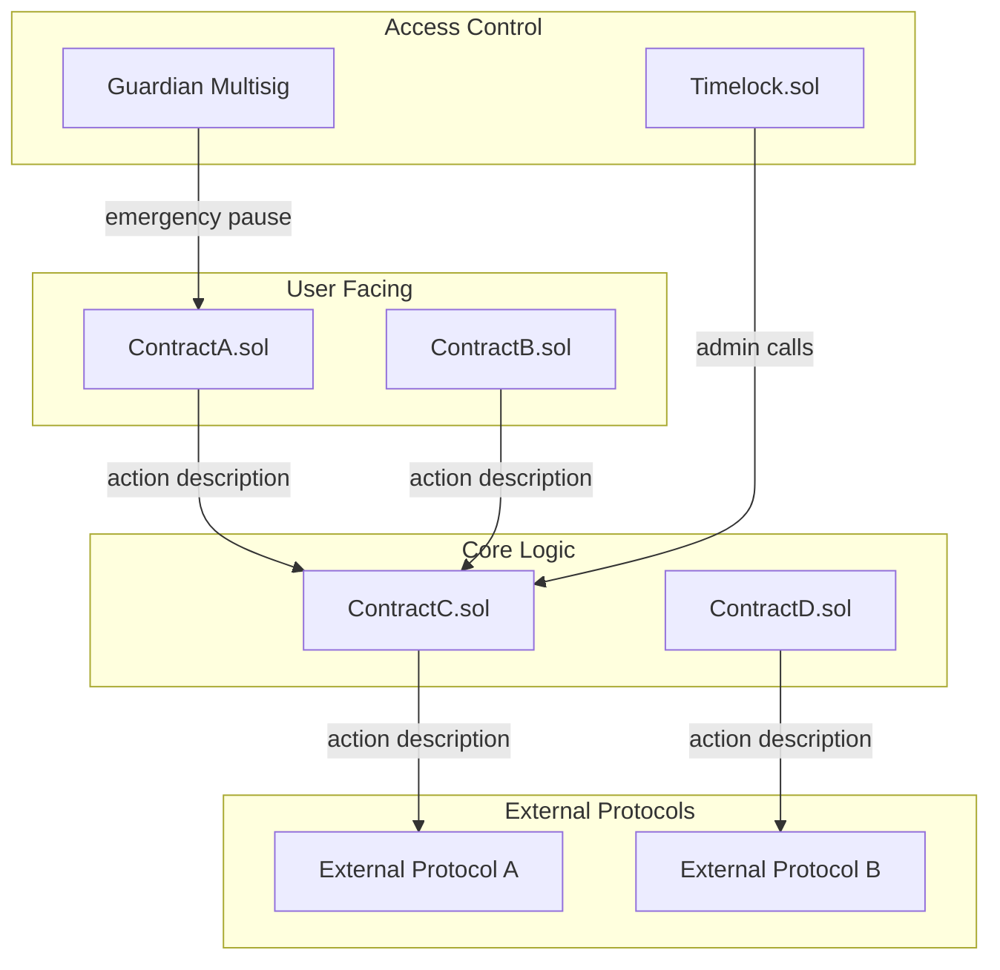
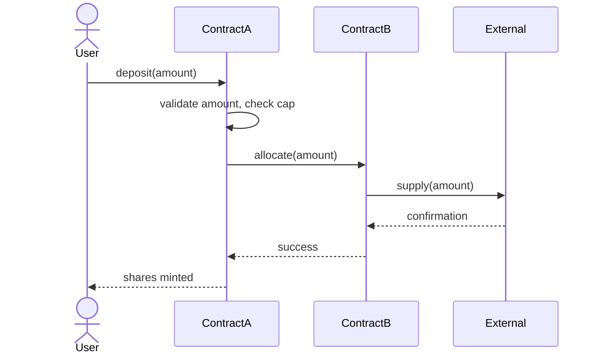
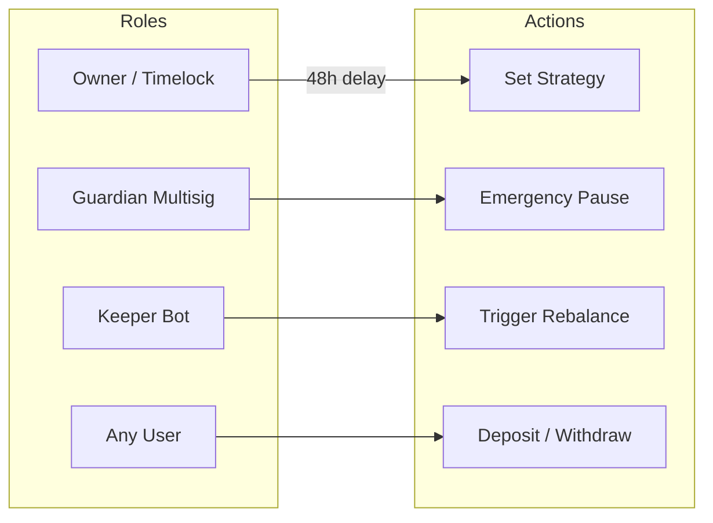
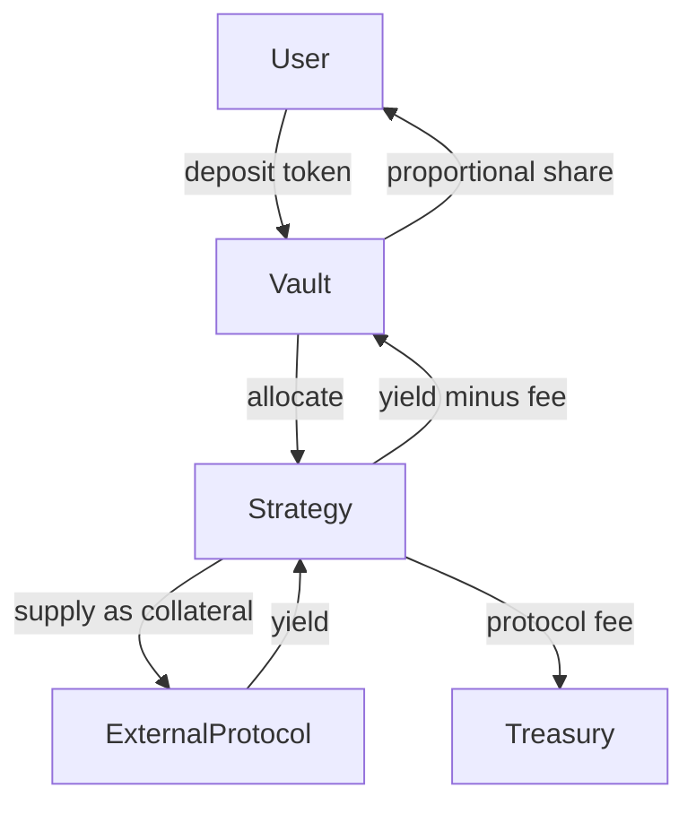
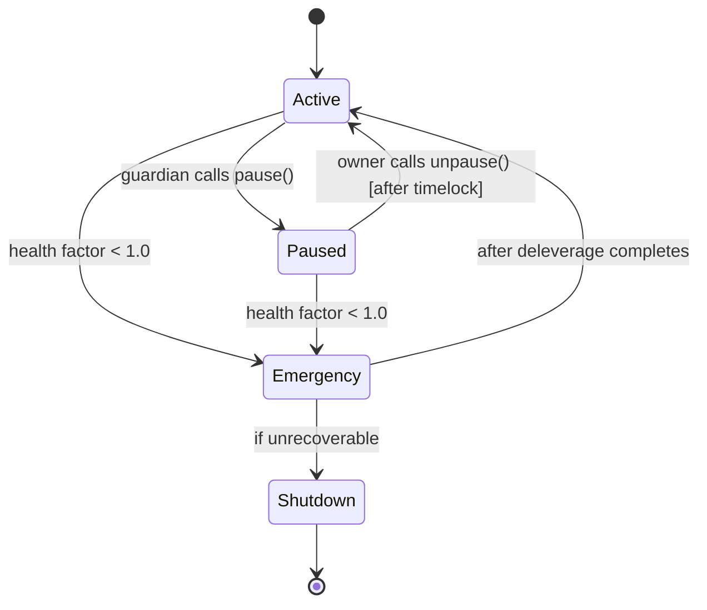

# Codebase Documentation Report Template

Use this template to produce a markdown document that enables developers to understand a protocol's architecture, user flows, and trust boundaries. Populate each section using Slither printer output (Phase 1) and code reading (Phase 2).

Replace all `[bracketed placeholders]` with actual values. Delete sections that do not apply to the project. Every Mermaid diagram must have labeled edges.

---

## How to Populate This Document

This is NOT a reformatting of Slither printer output — you must go through the actual source code to fill in context that printers cannot provide (protocol purpose, user flows, fee logic, state transitions, trust assumptions). Use the printers as your guide and fact-checking source, not as your only input.

### Reading Printer Output Files

All printer outputs live in `audit-output/phase-1-recon/printers/`. **For each section below, read the listed files fresh** — do not rely on memory from earlier reads. These files can be large, and misremembering a detail (e.g., which modifier guards a function) is a hallucination source.

| Report Section | Read These Files Before Writing | Code Reading? |
|---------------|-------------------------------|---------------|
| System Overview | — | Yes — README, code comments, contract names |
| Project Structure | — | Light — `ls`/`find` + annotate |
| Architecture | `printers/inheritance-graph*.dot`, `printers/call-graph*.dot` | Light — verify relationships |
| Contract Inventory | `printers/human-summary.txt`, `printers/inheritance.txt` | Light — add purpose descriptions |
| Contract Deep Dives | `printers/function-summary.txt`, `printers/variable-order.txt`, `printers/entry-points.txt`, `printers/modifiers.txt` | Yes — understand function logic |
| User Flows | `printers/call-graph*.dot`, `printers/function-summary.txt` | Yes — trace complete flows |
| Access Control Matrix | `printers/vars-and-auth.txt`, `printers/modifiers.txt` | Yes — verify guard logic |
| Value Flow | `printers/function-summary.txt` (filter: payable, transfer, mint, burn) | Yes — trace token/ETH movement |
| State Machine | `printers/not-pausable.txt` | Yes — identify state transitions |
| External Dependencies | `printers/call-graph*.dot`, `printers/data-dependency.txt` | Yes — identify failure modes |
| Upgrade & Migration | `printers/variable-order.txt` | Yes — verify storage layout |
| Key Invariants | Synthesized from hypothesis list + code reading | Yes — identify protocol rules |
| Known Risks & Trust Assumptions | Code reading (updated with Phase 3 detector findings) | Yes — assess trust boundaries |

---

## Template

````markdown
# [Protocol Name] — Codebase Overview

> **Commit:** `[commit hash]`
> **Solidity Version:** [version]
> **Chain(s):** [target chains]
> **Date:** [YYYY-MM-DD]

---

## 1. System Overview

[One paragraph. What the protocol does, who uses it, what value it creates. Written so a developer with zero context can understand in 30 seconds. No jargon.]

---

## 2. Project Structure

[Show the project's source directory tree with short annotations. This gives any reader an instant map of where code lives before diving into diagrams and deep dives. Only include directories and files that are in scope — omit `node_modules/`, `lib/`, build artifacts, etc.]

```
src/
├── core/
│   ├── Vault.sol              # Main user-facing vault (deposit, withdraw, share accounting)
│   ├── Strategy.sol           # Yield strategy interface and base implementation
│   └── Router.sol             # Multi-vault routing and batched operations
├── governance/
│   ├── Governor.sol           # On-chain governance (propose, vote, execute)
│   └── Timelock.sol           # Execution delay for governance actions
├── libraries/
│   ├── MathLib.sol            # Fixed-point math, rounding helpers
│   └── SafeCastLib.sol        # Safe integer downcasting
├── interfaces/
│   ├── IVault.sol
│   ├── IStrategy.sol
│   └── IOracle.sol
└── periphery/
    ├── OracleAdapter.sol      # Chainlink / Pyth price feed wrapper
    └── FeeCollector.sol       # Protocol fee accumulation and distribution
```

**Rules for this section:**
- Use a plain text tree (`├──`, `└──`, `│`) — not Mermaid
- Annotate every file/directory with a short comment (`#`) explaining its purpose
- Group by logical layer (user-facing, core, libraries, periphery, governance, etc.)
- If the project has multiple top-level source directories (e.g., `src/` and `contracts/`), show all of them
- Mark files that are **out of scope** with `# [OUT OF SCOPE]` rather than omitting them, so the reader knows they exist

**Populated from:** `ls`/`find` on project directory + code reading for annotations

---

## 3. Architecture



**Diagram rules:**
- Top-to-bottom (`TB`) for hierarchy — user at top, external at bottom
- Edge labels describe the **action**, not the function name
- Use subgraphs to group by trust boundary
- Never more than ~15 nodes — split into multiple diagrams if needed

**Populated from:** Read `printers/inheritance-graph*.dot` + `printers/call-graph*.dot`

---

## 4. Contract Inventory

| Contract | LOC | Purpose | Upgradeable | Inherits |
|----------|-----|---------|-------------|----------|
| [Name.sol] | [N] | [One sentence] | [Yes (UUPS) / No] | [Parent contracts] |

**Populated from:** Read `printers/human-summary.txt` + `printers/inheritance.txt`

---

## 5. Contract Deep Dives

Repeat this section for each core contract (skip trivial contracts like interfaces or pure libraries).

### 5.X [ContractName.sol]

**Purpose:** [One sentence]

**Inheritance Chain:**
```
ContractName → BaseContract → OpenZeppelinX
```

#### State Variables

| Variable | Type | Visibility | Purpose |
|----------|------|------------|---------|
| [name] | [type] | [public/private/internal] | [what it stores] |

**Populated from:** Read `printers/variable-order.txt` + `printers/function-summary.txt`

#### Functions

| Function | Visibility | Modifiers | State Changes | Description |
|----------|-----------|-----------|---------------|-------------|
| [name] | [external/public] | [modifier list] | [reads X, writes Y] | [what it does] |

**Populated from:** Read `printers/function-summary.txt` + `printers/entry-points.txt`

#### Constants & Immutables

| Name | Type | Value | Purpose |
|------|------|-------|---------|
| [name] | [type] | [value] | [what it represents — e.g., fee denominator, max supply cap] |

#### Custom Errors

| Error | Parameters | Thrown When |
|-------|-----------|------------|
| [name] | [param list] | [trigger condition] |

**Populated from:** `forge inspect <Contract> errors`

#### Events

| Event | Parameters | Emitted When |
|-------|-----------|-------------|
| [name] | [param list] | [trigger condition] |

#### Modifiers

| Modifier | Purpose | Used By |
|----------|---------|---------|
| [name] | [what it checks] | [function list] |

**Populated from:** Read `printers/modifiers.txt`

#### Assembly Usage

[Only include if the contract contains inline assembly. Flag each `assembly` block with its purpose and a note that it requires manual security review — Slither cannot analyze assembly semantics.]

| Location | Purpose | Risk Notes |
|----------|---------|------------|
| [`function():L45-L60`] | [e.g., optimized memory copy] | [e.g., unchecked return value, raw SSTORE] |

---

## 6. User Flows

One sequence diagram per major user action. Include the **entry point**, **actors**, **preconditions**, **state changes**, and **edge cases**.

### 6.X [Flow Name — e.g., Deposit]

**Entry Point:** `[Contract.function()]`
**Actors:** [User / Keeper / Admin]
**Preconditions:** [e.g., User has approved tokens]



**State Changes:**
- `contractA.balances[user]` += amount
- `contractA.totalSupply` += shares

**Edge Cases:**
- First depositor: [what happens]
- Zero amount: [what happens]
- At deposit cap: [what happens]

**Populated from:** Read `printers/call-graph*.dot` + `printers/function-summary.txt` + Foundry `-vvvv` trace output

---

## 7. Access Control Matrix



| Role | Address Type | Can Do | Cannot Do |
|------|-------------|--------|-----------|
| [Owner] | [Timelock (48h)] | [list of actions] | [list of restrictions] |
| [Guardian] | [3/5 Multisig] | [list of actions] | [list of restrictions] |

### Privilege Escalation Paths

[Document how roles can be changed. Who can grant/revoke roles? Can the owner change the timelock delay?]

**Populated from:** Read `printers/vars-and-auth.txt` + `printers/modifiers.txt`

---

## 8. Value Flow



### Fee Structure

| Fee | Amount | Collected By | Collected When |
|-----|--------|-------------|---------------|
| [Entry fee] | [0.1%] | [Vault] | [On deposit] |

### Token Accounting

[Explain the share/asset math. How is the exchange rate calculated? How is rounding handled? Where can precision loss occur?]

```
shares = (depositAmount * totalShares) / totalAssets
assets = (shareAmount * totalAssets) / totalShares
```

**Populated from:** Read `printers/function-summary.txt` (filter: payable, transfer, mint, burn)

---

## 9. State Machine

Only include this section if the protocol has discrete states (paused/active/emergency/migrating).



| State | Deposits | Withdrawals | Admin Ops | Rebalance |
|-------|---------|-------------|-----------|-----------|
| Active | Yes | Yes | Yes | Yes |
| Paused | No | Yes | Yes | No |
| Emergency | No | Yes (partial) | Limited | Auto |
| Shutdown | No | Yes (pro-rata) | No | No |

**Populated from:** Read `printers/not-pausable.txt` + code reading of state transition functions

---

## 10. External Dependencies

| Protocol | Contract Address | Usage | Failure Mode |
|----------|-----------------|-------|-------------|
| [Aave V3] | [`0x...`] | [Lending] | [Pool frozen -> can't withdraw] |

### Oracle Configuration

| Feed | Heartbeat | Deviation | Staleness Check |
|------|-----------|-----------|----------------|
| [ETH/USD] | [1h] | [0.5%] | [`require(updatedAt > block.timestamp - 3600)`] |

**Populated from:** Read `printers/call-graph*.dot` + `printers/data-dependency.txt` + code reading

---

## 11. Upgrade & Migration

Only include if the protocol uses a proxy/upgradeable pattern.

### Proxy Pattern

[UUPS / Transparent / Diamond / None]

### Storage Layout

[Use `variable-order` printer output. For visual representation:]

| Slot | Variable | Type | Contract |
|------|----------|------|----------|
| 0 | owner | address | Ownable |
| 1 | totalAssets | uint256 | Vault |
| 2 | strategy | address | Vault |
| 3-49 | __gap | uint256[47] | VaultBase |

### Upgrade Authorization

[Who can trigger upgrades? What timelock? Is there a safety check (e.g., UUPS `_authorizeUpgrade`)?]

**Populated from:** Read `printers/variable-order.txt` + `slither-check-upgradeability` output

---

## 12. Key Invariants

These are the rules that must NEVER be broken. Each one should map to an `invariant_` test in Phase 5 (Additional Verification).

| # | Invariant | Enforced By |
|---|-----------|------------|
| 1 | `totalAssets >= totalDebt` | [Strategy accounting logic] |
| 2 | Only Timelock can change strategy | [`onlyOwner` + Timelock delay] |
| 3 | Share price never decreases outside of loss events | [Rounding always favors vault] |
| 4 | Withdrawals never revert in Paused state | [Separate pause flags for deposit/withdraw] |

**Populated from:** Synthesized from Phase 2 hypothesis list + Phase 2/4 code reading

---

## 13. Known Risks & Trust Assumptions

| # | Assumption | Impact If Broken |
|---|-----------|-----------------|
| 1 | [Chainlink oracle is accurate within 0.5%] | [Rebalancer makes bad trades] |
| 2 | [Aave V3 pool won't freeze the USDC market] | [Funds temporarily locked] |
| 3 | [Timelock owner keys are not compromised] | [Full protocol takeover] |

---

## Appendix A: Deployment & Configuration

| Parameter | Value | Setter | Constraint |
|-----------|-------|--------|-----------|
| [depositCap] | [10M USDC] | [Owner (timelocked)] | [Min: 0, Max: uint256.max] |

## Appendix B: Function Selector Table

Useful for reading raw calldata in multisig transactions and timelock queues.

| Selector | Function | Contract |
|----------|----------|----------|
| [`0xa694fc3a`] | [`deposit(uint256)`] | [Vault] |

**Populated from:** Read `printers/function-id.txt`
````

---

## Section-by-Section Reference

| Section | Answers | Primary Audience |
|---------|---------|-----------------|
| System Overview | "What does this do?" | Everyone |
| Project Structure | "Where does the code live?" | New devs, auditors onboarding |
| Architecture | "How do contracts connect?" | New devs, auditors |
| Contract Inventory | "What am I looking at?" | New devs |
| Contract Deep Dives | "What does this contract do exactly?" | Devs working on specific contracts |
| User Flows | "What happens when a user does X?" | Frontend devs, integrators, auditors |
| Access Control | "Who can do what?" | Security reviewers, ops team |
| Value Flow | "How does money move?" | Auditors, economists |
| State Machine | "What states can the system be in?" | Ops team, incident responders |
| External Dependencies | "What can break us from outside?" | Risk team, auditors |
| Upgrade & Migration | "How does upgrading work?" | Auditors, ops team |
| Key Invariants | "What must always be true?" | Auditors, fuzz test writers |
| Known Risks | "What are we trusting?" | Everyone |

---

## Fact-Checking Checklist

This document builds the mental model for the entire audit. Hallucinations here propagate into every subsequent phase. Before marking the document complete:

**Structural verification (re-read each printer file to cross-check):**

- [ ] Every contract relationship in the Architecture diagram exists in `printers/inheritance-graph*.dot` and `printers/call-graph*.dot` (or is justified by code reading of delegatecall/interface calls)
- [ ] Every function listed in Contract Deep Dives matches `printers/function-summary.txt` — visibility, modifiers, and state variables read/written are correct
- [ ] Every access control claim in the Access Control Matrix matches `printers/vars-and-auth.txt` and `printers/modifiers.txt`
- [ ] Storage layout in Upgrade & Migration matches `printers/variable-order.txt`

**Flow verification (cross-check against code or Foundry traces):**

- [ ] At least one happy-path user flow has been verified by tracing through the code or running an existing test with `forge test -vvvv`
- [ ] Value flow diagrams accurately reflect where tokens/ETH enter, move through, and exit the system

**Uncertainty handling:**

- [ ] Any section containing assumptions that could not be verified is flagged: *"[Unverified assumption: ...]"*
- [ ] No section presents speculation as fact

**Document quality:**

- [ ] Every section is independently useful (a developer can jump to any section without reading prior ones)
- [ ] Tables for structured data, diagrams for relationships, prose only for context
- [ ] All unhappy paths documented (edge cases, failure modes, what happens when things break)
- [ ] Commit hash is recorded — stale docs are worse than no docs
