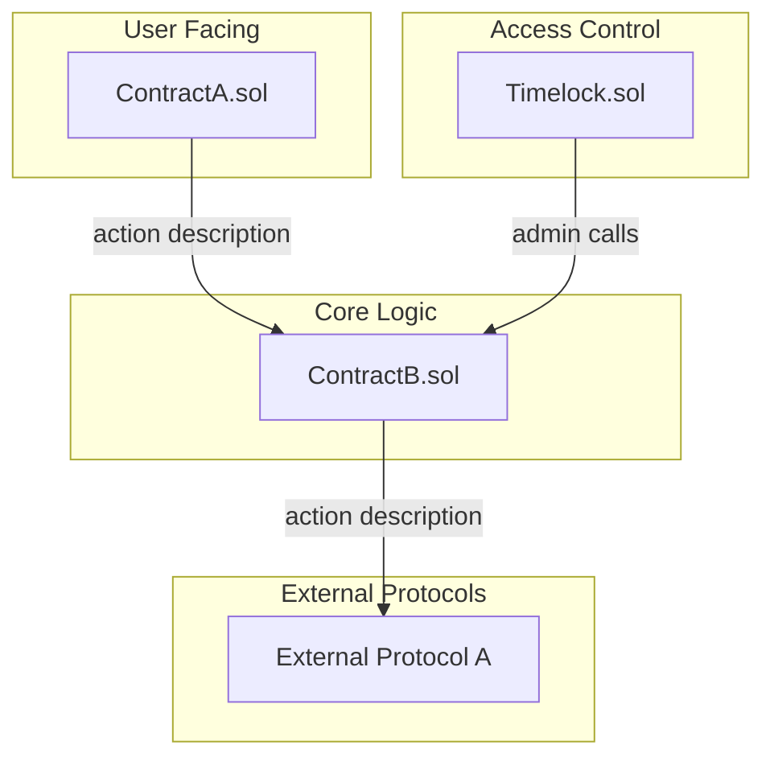
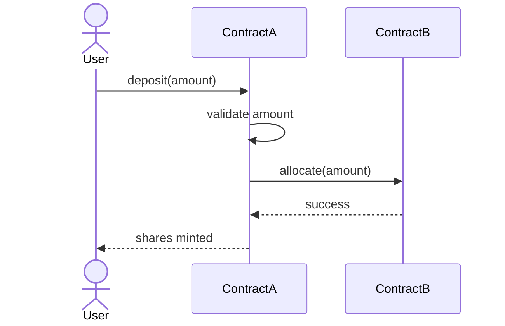
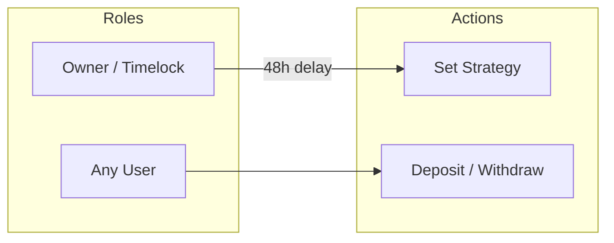
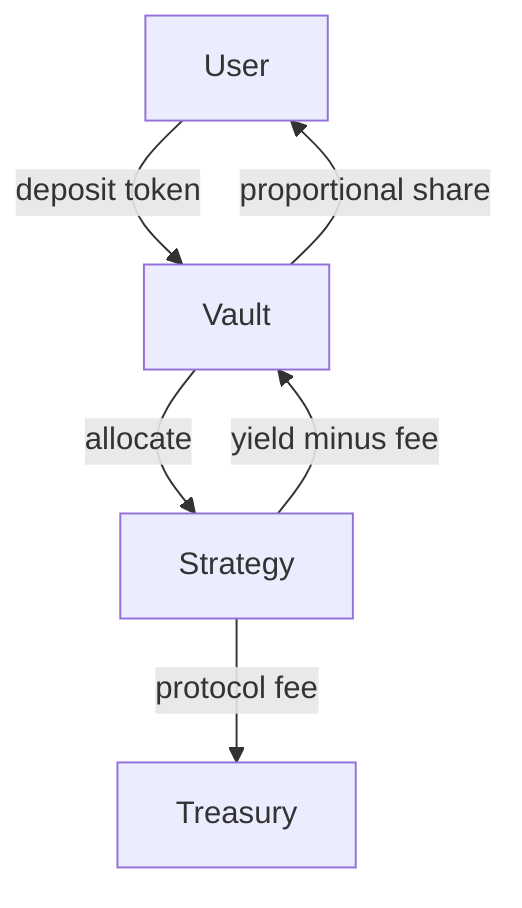
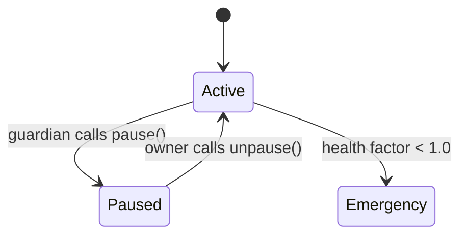

# Codebase Documentation Report Template

See `codebase-report-guide.md` for the population methodology — which inputs feed each section.

Replace all `[bracketed placeholders]` with actual values. Delete sections that do not apply. Every Mermaid diagram must have labeled edges.

---

````markdown
# [Protocol Name] — Codebase Overview

> **Commit:** `[commit hash]`
> **Solidity Version:** [version]
> **Chain(s):** [target chains]
> **Date:** [YYYY-MM-DD]

---

## 1. System Overview

[One paragraph. What the protocol does, who uses it, what value it creates. Written so a developer with zero context can understand in 30 seconds.]

---

## 2. Project Structure

[Show the project's in-scope source directory tree with short annotations.]

```
src/
├── core/
│   ├── Vault.sol              # Main user-facing vault
│   └── Strategy.sol           # Yield strategy interface
├── governance/
│   └── Governor.sol           # On-chain governance
├── libraries/
│   └── MathLib.sol            # Fixed-point math helpers
└── periphery/
    └── OracleAdapter.sol      # Price feed wrapper
```

---

## 3. Architecture



---

## 4. Contract Inventory

| Contract | LOC | Purpose | Upgradeable | Inherits |
|----------|-----|---------|-------------|----------|
| [Name.sol] | [N] | [One sentence] | [Yes (UUPS) / No] | [Parent contracts] |

---

## 5. Contract Deep Dives

Repeat for each core contract (skip trivial interfaces or pure libraries).

### 5.X [ContractName.sol]

**Purpose:** [One sentence]

**Inheritance Chain:**
```
ContractName → BaseContract → OpenZeppelinX
```

#### State Variables

| Variable | Type | Visibility | Purpose |
|----------|------|------------|---------|
| [name] | [type] | [public/private/internal] | [what it stores] |

#### Functions

| Function | Visibility | Modifiers | State Changes | Description |
|----------|-----------|-----------|---------------|-------------|
| [name] | [external/public] | [modifier list] | [reads X, writes Y] | [what it does] |

#### Constants & Immutables

| Name | Type | Value | Purpose |
|------|------|-------|---------|
| [name] | [type] | [value] | [what it represents] |

#### Custom Errors

| Error | Parameters | Thrown When |
|-------|-----------|------------|
| [name] | [param list] | [trigger condition] |

#### Events

| Event | Parameters | Emitted When |
|-------|-----------|-------------|
| [name] | [param list] | [trigger condition] |

#### Modifiers

| Modifier | Purpose | Used By |
|----------|---------|---------|
| [name] | [what it checks] | [function list] |

#### Assembly Usage

[Only include if the contract contains inline assembly.]

| Location | Purpose | Risk Notes |
|----------|---------|------------|
| [`function():L45-L60`] | [e.g., optimized memory copy] | [e.g., unchecked return value] |

---

## 6. User Flows

One sequence diagram per major user action.

### 6.X [Flow Name — e.g., Deposit]

**Entry Point:** `[Contract.function()]`
**Actors:** [User / Keeper / Admin]
**Preconditions:** [e.g., User has approved tokens]



**State Changes:**
- `contractA.balances[user]` += amount
- `contractA.totalSupply` += shares

**Edge Cases:**
- First depositor: [what happens]
- Zero amount: [what happens]
- At deposit cap: [what happens]

---

## 7. Access Control Matrix



| Role | Address Type | Can Do | Cannot Do |
|------|-------------|--------|-----------|
| [Owner] | [Timelock (48h)] | [list] | [list] |

### Privilege Escalation Paths

[Who can grant/revoke roles? Can the owner change the timelock delay?]

---

## 8. Value Flow



### Fee Structure

| Fee | Amount | Collected By | Collected When |
|-----|--------|-------------|---------------|
| [Entry fee] | [0.1%] | [Vault] | [On deposit] |

### Token Accounting

[Share/asset math. Exchange rate calculation. Rounding direction. Where precision loss can occur.]

```
shares = (depositAmount * totalShares) / totalAssets
assets = (shareAmount * totalAssets) / totalShares
```

---

## 9. State Machine

Only include if the protocol has discrete states.



| State | Deposits | Withdrawals | Admin Ops | Rebalance |
|-------|---------|-------------|-----------|-----------|
| Active | Yes | Yes | Yes | Yes |
| Paused | No | Yes | Yes | No |

---

## 10. External Dependencies

| Protocol | Contract Address | Usage | Failure Mode |
|----------|-----------------|-------|-------------|
| [Aave V3] | [`0x...`] | [Lending] | [Pool frozen → can't withdraw] |

### Oracle Configuration

| Feed | Heartbeat | Deviation | Staleness Check |
|------|-----------|-----------|----------------|
| [ETH/USD] | [1h] | [0.5%] | [`require(updatedAt > block.timestamp - 3600)`] |

---

## 11. Upgrade & Migration

Only include if proxy/upgradeable pattern is used.

### Proxy Pattern
[UUPS / Transparent / Diamond / None]

### Storage Layout

| Slot | Variable | Type | Contract |
|------|----------|------|----------|
| 0 | owner | address | Ownable |
| 1 | totalAssets | uint256 | Vault |
| 3-49 | __gap | uint256[47] | VaultBase |

### Upgrade Authorization
[Who can trigger upgrades? What timelock? Is there a safety check?]

---

## 12. Key Invariants

These are the rules that must NEVER be broken. When time permits in Phase 5, write `invariant_` tests for the most critical entries.

| # | Invariant | Enforced By |
|---|-----------|------------|
| 1 | `totalAssets >= totalDebt` | [Strategy accounting logic] |
| 2 | Only Timelock can change strategy | [`onlyOwner` + Timelock delay] |
| 3 | Share price never decreases outside of loss events | [Rounding always favors vault] |

---

## 13. Known Risks & Trust Assumptions

| # | Assumption | Impact If Broken |
|---|-----------|-----------------|
| 1 | [Chainlink oracle is accurate within 0.5%] | [Rebalancer makes bad trades] |
| 2 | [Aave V3 pool won't freeze the USDC market] | [Funds temporarily locked] |

---

## Appendix A: Deployment & Configuration

| Parameter | Value | Setter | Constraint |
|-----------|-------|--------|-----------|
| [depositCap] | [10M USDC] | [Owner (timelocked)] | [Min: 0, Max: uint256.max] |

## Appendix B: Function Selector Table

| Selector | Function | Contract |
|----------|----------|----------|
| [`0xa694fc3a`] | [`deposit(uint256)`] | [Vault] |
````

---

## Fact-Checking Checklist

Run this before marking the document complete. Hallucinations here propagate into every subsequent phase.

**Structural verification (cross-check against structural summary; consult raw printer files only if needed):**

- [ ] Every contract relationship in the Architecture diagram is consistent with the structural summary section 2 (Inheritance Tree)
- [ ] Every function in Contract Deep Dives matches the structural summary section 3 — visibility, modifiers, and state variables are correct
- [ ] Every access control claim is consistent with structural summary sections 3 and 4
- [ ] Storage layout in Upgrade & Migration matches structural summary section 5

**Flow verification (cross-check against code or Foundry traces):**

- [ ] At least one happy-path user flow verified by tracing through code or running `forge test -vvvv`
- [ ] Value flow diagrams accurately reflect where tokens/ETH enter, move through, and exit

**Uncertainty handling:**

- [ ] Any section containing unverified assumptions is flagged: *"[Unverified assumption: ...]"*
- [ ] No section presents speculation as fact

**Document quality:**

- [ ] Every section is independently useful
- [ ] Tables for structured data, diagrams for relationships, prose only for context
- [ ] All unhappy paths documented (edge cases, failure modes)
- [ ] Commit hash is recorded
